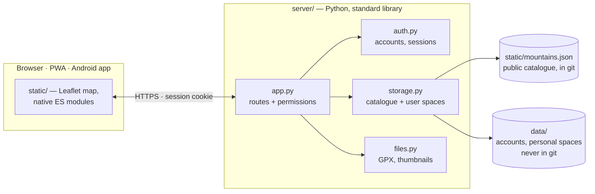

<div align="center">


# Altus

**The 45 summits above 3,000 m in the French Alps and Pyrenees that you can reach on foot —
no mandatory glacier, no rope, no via ferrata — on one map, with your personal climbing log.**

[](https://github.com/celtill0s/Altus3k/actions/workflows/ci.yml)
[](https://github.com/celtill0s/Altus3k/releases)

[](LICENSE)


[Français](README.md) · [Features](#features) · [Screenshots](#screenshots) · [Quick start](#quick-start) · [Self-hosting](docs/en/self-hosting.md) · [Documentation](#documentation)


</div>

> The app itself is in French (interface, summit notes and route descriptions). This page and the
> [English documentation](#documentation) are for visitors and self-hosters.

## Features

**The map of the 3,000 m peaks**
- 45 hand-picked summits graded T2 to T4 on the SAC hiking scale, each with access notes, a
  source and a photo.
- IGN topographic map, IGN aerial imagery or OpenStreetMap; slopes-over-30° overlay.
- Search, filters by range, grade and status; live GPS location.

**Your climbing log**
- Tick a summit off and record the date; keep a wish list.
- For each summit: a personal note, photos and videos, a GPX track with an elevation profile
  linked to the map.
- **Mes 3000** ("My 3000s"): your progress (X/45, by mountain range), your latest ascents,
  your wish list.
- Add your own summits, visible only to you.

**Off season**
- Three dedicated views: **crampons + ice axe**, **ski touring** (35 summits) and
  **snowshoeing**, each with its own grades, routes and a link to the full route description.
- Slopes over 30° shown by default, plus safety reminders (avalanche transceiver, avalanche
  bulletin).

**Everywhere**
- On a phone: bottom tab bar Map · List · My 3000s · Profile.
- Installable as an app (PWA) or through the [Android app](android/README.md); works offline
  for anything already viewed.
- Several accounts on one instance, each with a private space.

## Screenshots

<table>
  <tr>
    <td width="50%" valign="top">
      
      <p align="center"><b>The summit card</b><br>photo, key figures, ascent date, wish list, note, media, GPX track</p>
    </td>
    <td width="50%" valign="top">
      
      <p align="center"><b>Winter views</b><br>ski, snowshoes, crampons: routes, route descriptions and slopes over 30°</p>
    </td>
  </tr>
  <tr>
    <td width="50%" valign="top">
      
      <p align="center"><b>My 3000s</b><br>your progress and the history of your ascents</p>
    </td>
    <td width="50%" valign="top">
      
      <p align="center"><b>On a phone</b><br>map, list and summit card, one thumb away</p>
    </td>
  </tr>
</table>

## Safety

Altus helps you **choose** an outing, not **prepare it on your own**. Grades are indicative and
routes are summarised: before you go, read a full route description, check the weather and,
whenever there is snow, the Météo-France **avalanche bulletin (BERA)**. Conditions (snow cover,
snowfields, rock) change from one season, and one day, to the next; in winter, everyone carries
a transceiver, shovel and probe.

## Quick start

Just Python 3, no Docker, no dependencies:

```bash
git clone https://github.com/celtill0s/Altus3k.git && cd Altus3k
python3 server/app.py create-admin me    # once: creates your account
python3 server/app.py                    # then open http://localhost:8000
```

Data is stored in `data/` (created automatically, never committed). For a real server
(Docker + Caddy, Raspberry Pi…), see **[Self-hosting](docs/en/self-hosting.md)**.

## Architecture



- **Frontend**: plain HTML, CSS and JavaScript (ES modules, no framework, no build step), with a
  [Leaflet](https://leafletjs.com/) map bundled in the repository.
- **Backend**: Python, standard library only (Pillow is optional, for thumbnails and HEIC
  photos). It serves the site and merges the **public catalogue** (`static/mountains.json`,
  versioned) with each user's **personal space** (`data/`, never in git).

Anyone can therefore clone this repository and host their own instance, with the same catalogue
or their own, without ever getting someone else's personal data.

## Documentation

| Page | Content |
|---|---|
| [Features in detail](docs/en/features.md) | base maps, offline use, installable app, media, activity views, My 3000s |
| [Self-hosting](docs/en/self-hosting.md) | Docker + Caddy setup, updates, backups, migrating older instances |
| [Accounts and roles](docs/en/accounts.md) | guest, member, administrator; security; quota; admin commands |
| [Editing the catalogue](docs/en/catalogue.md) | summit schema, crampon / ski / snowshoe / photo fields, rules for `id`s |
| [Development](docs/en/development.md) | repository layout, tests, screenshots |
| [Android app](android/README.md) | installing the APK, publishing a release (in French) |
| [Sources and method](sources.md) | how summits were selected, grading scale, known limits (in French) |

## License

- **Code** (server, website, Android app): [GNU AGPL v3](LICENSE). You may use, modify and host
  it freely; if you run a modified version for other people, you must give them access to its
  source code.
- **Summit catalogue** (`static/mountains.json`, `sources.md`):
  [CC BY-SA 4.0](LICENSE-catalogue.md), reusable with attribution to Altus.
- **Photos**: each keeps its original free license (see below).

## Credits

- **Base maps**: [IGN – Géoplateforme](https://geoservices.ign.fr/) (topographic map, aerial
  imagery, slopes) and [OpenStreetMap](https://www.openstreetmap.org/copyright) and its
  contributors.
- **Summit photos**: [Wikimedia Commons](https://commons.wikimedia.org/), under free licenses
  (CC BY, CC BY-SA, CC0); each photo's author and license are shown below its banner and listed
  in `static/mountains.json` (`image` field).
- **Grades and routes**: [camptocamp.org](https://www.camptocamp.org/),
  [skitour.fr](https://skitour.fr/), [altituderando.com](https://www.altituderando.com/) and the
  other sources cited for each summit (see [`sources.md`](sources.md)).
- **Libraries**: [Leaflet](https://leafletjs.com/) and
  [Leaflet.markercluster](https://github.com/Leaflet/Leaflet.markercluster), bundled with their
  licenses in `static/vendor/`.
