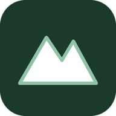
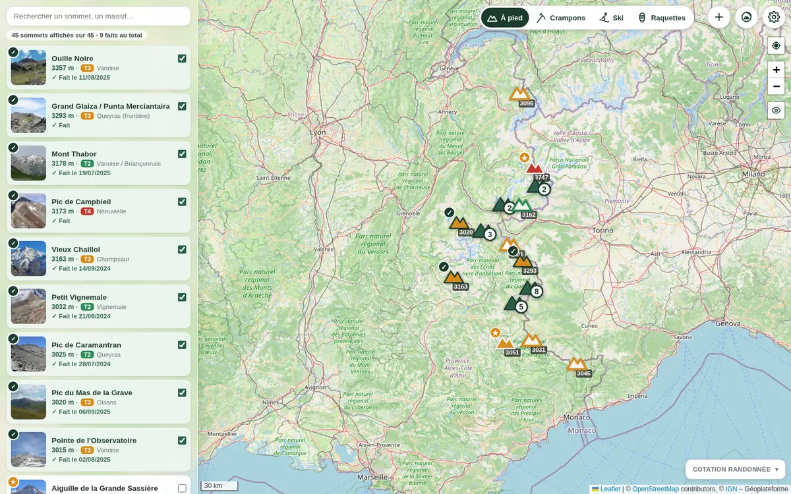
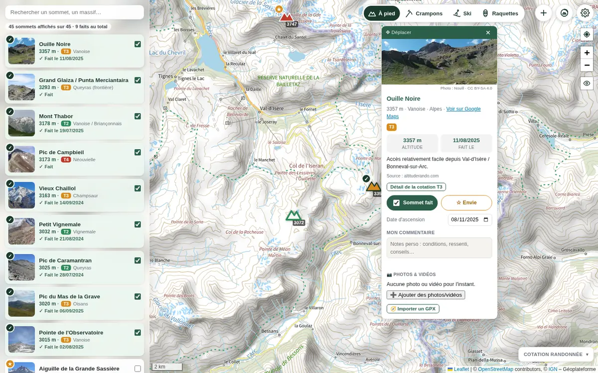
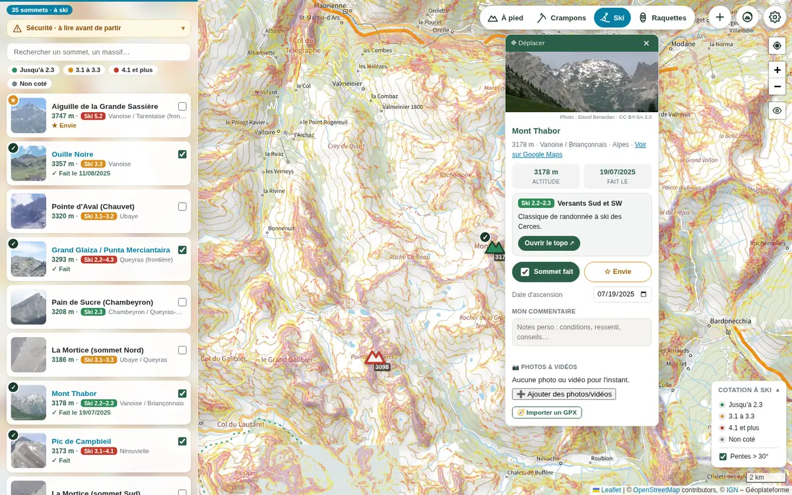
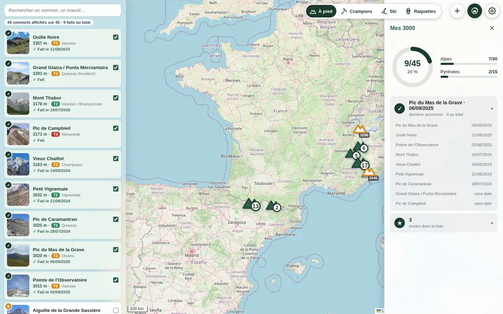
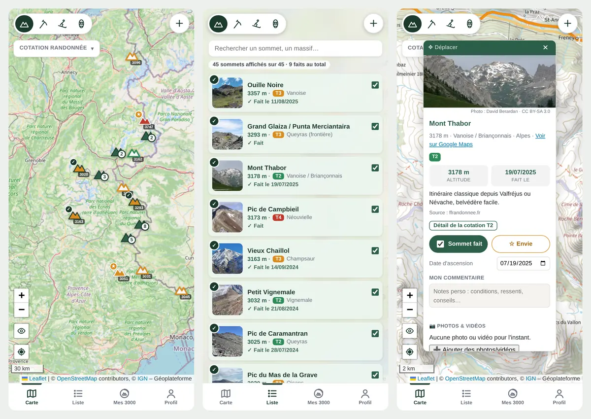
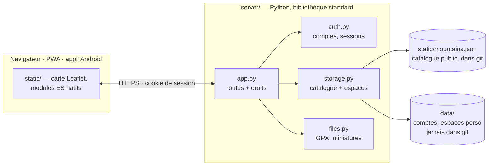

<div align="center">



# Altus

**Les 45 sommets de plus de 3000 m des Alpes et des Pyrénées françaises accessibles à pied —
sans glacier obligatoire, sans corde, sans via ferrata — sur une carte, avec ton carnet de
courses personnel.**

[](https://github.com/celtill0s/Altus3k/actions/workflows/ci.yml)
[](https://github.com/celtill0s/Altus3k/releases)

[](LICENSE)


[English](README.en.md) · [Fonctionnalités](#fonctionnalités) · [Aperçu](#aperçu) · [Démarrage rapide](#démarrage-rapide) · [Auto-hébergement](docs/auto-hebergement.md) · [Appli Android](android/README.md) · [Documentation](#documentation)



</div>

## Fonctionnalités

**La carte des 3000**
- 45 sommets triés et cotés T2 à T4 (échelle de randonnée CAS/SAC), chacun avec ses notes
  d'accès, sa source et sa photo.
- Fonds Plan IGN, photos aériennes IGN ou OpenStreetMap ; calque des pentes > 30°.
- Recherche, filtres par massif, cotation et statut ; « me localiser » au GPS.

**Ton carnet de courses**
- Coche un sommet et date ton ascension ; garde une liste d'envies.
- Pour chaque sommet : commentaire, photos et vidéos, trace GPX avec un profil altimétrique
  relié à la carte.
- **Mes 3000** : ta progression (X/45, par massif), tes dernières ascensions, tes envies.
- Ajoute tes propres sommets, visibles de toi seul.

**Hors saison**
- Trois vues dédiées : **crampons + piolet**, **ski** (35 sommets) et **raquettes**, chacune avec
  ses cotations, ses itinéraires et un lien vers le topo.
- Pentes > 30° affichées d'office et rappels de sécurité (DVA, BERA).

**Partout**
- Sur téléphone : barre d'onglets Carte · Liste · Mes 3000 · Profil.
- Installable comme une appli (PWA) ou via l'[appli Android](android/README.md), utilisable
  hors ligne pour ce qui a déjà été consulté.
- Plusieurs comptes sur une même instance, chacun avec son espace privé.

## Aperçu

<table>
  <tr>
    <td width="50%" valign="top">
      
      <p align="center"><b>La fiche d'un sommet</b><br>photo, chiffres clés, date d'ascension, envie, commentaire, médias, trace GPX</p>
    </td>
    <td width="50%" valign="top">
      
      <p align="center"><b>Les vues d'hiver</b><br>ski, raquettes, crampons : itinéraires, topos et pentes > 30°</p>
    </td>
  </tr>
  <tr>
    <td width="50%" valign="top">
      
      <p align="center"><b>Mes 3000</b><br>ta progression et l'historique de tes ascensions</p>
    </td>
    <td width="50%" valign="top">
      
      <p align="center"><b>Sur téléphone</b><br>carte, liste et fiche, à un pouce de distance</p>
    </td>
  </tr>
</table>

## Sécurité

Altus aide à **choisir** une course, pas à **la préparer seul**. Les cotations sont
indicatives et les itinéraires résumés : avant de partir, consulte un topo complet, la météo et,
dès qu'il y a de la neige, le **bulletin d'estimation du risque d'avalanche (BERA)** de
Météo-France. Les conditions (enneigement, névés, rocher) changent d'une saison et d'un jour à
l'autre ; en hiver, DVA, pelle et sonde pour chacun.

## Démarrage rapide

Juste Python 3, sans Docker ni dépendance :

```bash
git clone https://github.com/celtill0s/Altus3k.git && cd Altus3k
python3 server/app.py create-admin moi   # une fois : crée ton compte
python3 server/app.py                    # puis ouvre http://localhost:8000
```

Les données sont stockées dans `data/` (créé automatiquement, jamais commité). Pour un vrai
serveur (Docker + Caddy, Raspberry Pi…), voir **[Auto-hébergement](docs/auto-hebergement.md)**.

## Architecture



- **Frontend** : HTML, CSS et JavaScript natifs (modules ES, sans framework ni étape de build),
  carte [Leaflet](https://leafletjs.com/) embarquée dans le dépôt.
- **Backend** : Python, bibliothèque standard uniquement (Pillow en option pour les
  miniatures et les photos HEIC). Il sert le site et fusionne le **catalogue public**
  (`static/mountains.json`, versionné) avec l'**espace personnel** de chaque utilisateur
  (`data/`, jamais dans git).

N'importe qui peut donc cloner ce dépôt pour héberger sa propre instance, avec le même catalogue
ou le sien, sans jamais récupérer les données personnelles de quelqu'un d'autre.

## Documentation

| Page | Contenu |
|---|---|
| [Fonctionnalités en détail](docs/fonctionnalites.md) | fonds de carte, hors-ligne, appli installable, médias, vues d'activité, Mes 3000 |
| [Auto-hébergement](docs/auto-hebergement.md) | installation Docker + Caddy, mise à jour, sauvegarde, migration des anciennes instances |
| [Comptes et rôles](docs/comptes.md) | invité, membre, administrateur ; sécurité ; quota ; commandes d'administration |
| [Modifier le catalogue](docs/catalogue.md) | schéma d'un sommet, champs crampons / ski / raquettes / photo, règles sur les `id` |
| [Développement](docs/developpement.md) | organisation du dépôt, tests, captures d'écran |
| [Appli Android](android/README.md) | installation de l'APK, publication d'une version |
| [Sources et méthode](sources.md) | sélection des sommets, barème de cotation, limites connues |

## Licence

- **Code** (serveur, site, appli Android) : [GNU AGPL v3](LICENSE). Tu peux l'utiliser, le
  modifier et l'héberger librement ; si tu fais tourner une version modifiée pour d'autres
  personnes, tu dois leur donner accès à son code source.
- **Catalogue des sommets** (`static/mountains.json`, `sources.md`) :
  [CC BY-SA 4.0](LICENSE-catalogue.md), à réutiliser en citant Altus.
- **Photos** : chacune garde sa licence libre d'origine (voir ci-dessous).

## Crédits

- **Fonds de carte** : [IGN – Géoplateforme](https://geoservices.ign.fr/) (Plan IGN, photos
  aériennes, pentes) et [OpenStreetMap](https://www.openstreetmap.org/copyright) et ses contributeurs.
- **Photos des sommets** : [Wikimedia Commons](https://commons.wikimedia.org/), sous licences
  libres (CC BY, CC BY-SA, CC0) ; l'auteur et la licence de chaque photo sont affichés sous son
  bandeau et listés dans `static/mountains.json` (champ `image`).
- **Cotations et itinéraires** : [camptocamp.org](https://www.camptocamp.org/),
  [skitour.fr](https://skitour.fr/), [altituderando.com](https://www.altituderando.com/) et les
  autres sources citées pour chaque sommet (voir [`sources.md`](sources.md)).
- **Bibliothèques** : [Leaflet](https://leafletjs.com/) et
  [Leaflet.markercluster](https://github.com/Leaflet/Leaflet.markercluster), embarquées avec leur
  licence dans `static/vendor/`.
